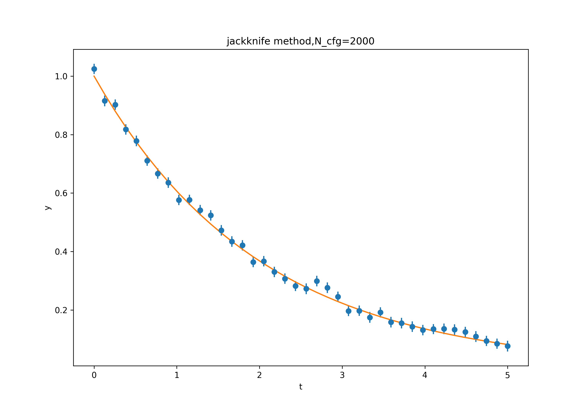

#LQCD #数据处理 

# 数据处理基础

本仓库记录格点QCD中用到的数据处理方法

  

## 重采样方法：Jackknife & Bootstrap

  

### 1.Data blocking method

由于通过Markov Monte Carlo 方法生成的数据实际上存在auto-correlation,所以为了消除corelation给数据分析带来的影响，

我们可以采用Data blocking method

方法如下：

1. 将原始数据分成大小为K的数据块

2. 计算每个数据块的平均值并将其作为一个新的变量 $X_{i}$

3. 此时每一个分块数据$X_{i}$  就可以认为是独立的

### 2.Jackknife

Jackknife方法和下面的Bootstrap方法是一种重采样方法，用以确定数据的平均值和误差
方法如下：

1. 首先我们有一组大小为N的数据，这些数据是原始数据，我们可以从中计算我们感兴趣的物理量$\theta$ ，比如有效质量
2. 利用这个N个数据计算感兴趣的物理量的平均值$\bar{{\theta}}$ ,比如有效质量的平均值
3. 接着分别剔除第 $i$  个数据，然后计算剩下的数据的平均值，记为 $\bar{\theta_{i}}$ 
4. 由jackknife得到的平均值为$$\widetilde{\theta} = \frac{1}{N}\sum \theta_{n} $$
5. 方差为$$ \sigma^2_{\hat{\theta}} = \frac{N-1}{N} \sum^N_{n=1}(\theta_{n} - \hat{\theta})^2 $$
为什么我们在意平均值？因为我们想要得到比如说质量，然后我们测量了好几次得到了好几个质量测量值，为了得到尽可能接近于真实质量的数据，我们就采用求平均值的方法，
但是由于数据的原因，所以我们采用了jackknife方法求平均值，同时给出误差
(公式不能很好的展示出来：（)

### 3.模拟数据分析

我们可以用模拟数据的方法尝试一下jackknife方法（bootstrap方法类似）。
我们使用一个已知的函数f(x)生成一系列数据，只要输入的x是一定的，那么y=f(x)的值也就是确定的。现在为了模拟测量结果，我们给他加入一些随机噪声，
这里我们使用正态分布函数来生成噪声，因为现实情况下得到的测量结果中的数据是符合这个分布滴。添加完了噪声之后，这一组测量结果算是捏造成功了，我们采用不同的随机数种子生成多组噪声添加到数据中来模拟多次测量得到的数据。现在我们有了很多组数据$Y^(i) = y_1,y_2,y_3....$。详细的生成过程请看源代码中的data_gen().

下面是重头戏。

那么我们要怎么使用jackknife呢？这里重要的就是要搞清楚我们要分析的数据是啥。举个简单的例子，如果我们对一个桌子测量了10次，那么这十个测量结果就是我们要分析的数据，直接求平均值就比较粗暴，还可以选择jackknife。这里我们面对的是很多组数据，每一组里面不是一个数而是一组数，这要怎么处理？
也很简单，现在的情况，就相当于你想研究热水壶扫热水的过程，你记录每一次水从室温到沸腾的温度-时间变化关系，你烧了100次水，每分钟测量一次，得到了100组数据，每一组数据就是一个一维数组，现在我们要来分析温度随时间到底是咋变化的。这时候可以用简单的方法，直接求平均值和误差。怎么求？我们应该将每一次第0min时的数据加起来求平均，第1min时的数据加起来求平均，，，，，最后得到一组数据，这组数据中是所有测量结果的平均值。因为现在的情况就相当于每一分钟你都测量了很多次，多次的结果如何综合起来呢？就可以用平均值或者jackknife方法等。所以说，现在我们使用jackknife方法也是对开始后同一个分钟下的测量结果进行，得到mean和error。比较一下可以发现，jackknife得到的结果误差要比简单求平均要小。
这里我的代码中使用的是一个E指数。

### 4.对比测试

为了对比我写的jackknife函数和bootstrap函数的正确性，我把我的自己写的函数和latqcdtools/Analysistoolbox中的函数对于同样的数据计算之后的结果进行对比，在采用相同算法的情况下，我们的结果应该是一模一样的。对于不同的算法得到的结果也应该是十分相近的。

主要涉及以下两个文件：
- myfunctions.py
- full_test.py

其中myfuncitons.py 中是这次测试中用到的我自己写的函数，其中my_bootstrap函数做了修改，因为我需要保证我采用的随机抽取中用到的随机数和bootstr中用到的一致。

采用的测试方法是利用analysistoolbox.testing,这部分是跟analysistoolbox中的test部分学的:)

测试结果表明，在epsilon=1e-6的条件下，所有的测试依旧是pass的。

